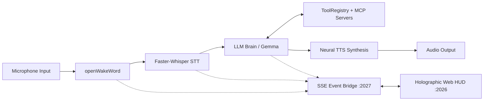

# Sara-AI-Assisstant

> **S.A.R.A.** — *Synthesized Artificial Reasoning Agent*  
> A local-first, voice-driven AI assistant with Model Context Protocol (MCP) tool support and a real-time holographic web telemetry HUD.

---

## 🌟 Features

- 🎙️ **Stage 1: Always-On Voice Capture & Wake Word**
  - Zero-latency timestamped ring buffer with pre-roll audio slicing.
  - Local CPU inference via `openWakeWord` with custom-trained acoustic models.
  - Adaptive ambient noise floor estimation and anti-spike trigger gating.
- ⚡ **Stage 2: Fast Speech-to-Text (STT)**
  - Local neural transcription via `faster-whisper` (CTranslate2 `int8`/`float16`).
  - Confidence scoring and anti-hallucination noise filters.
- 🧠 **Stage 3: LLM Brain & Model Context Protocol (MCP)**
  - Streaming tool-calling reasoning loop supporting Google Gemini API & local Ollama models.
  - Dynamic MCP client integration (JSON-RPC 2.0 stdio) for dynamic tool discovery.
  - Sandboxed workspace coding tools (`opencode_mcp_server`) and AST-evaluated math engine.
  - Configurable operator confirmation gates for shell & terminal actions.
- 🔊 **Stage 4: Natural Neural Speech Synthesis (TTS)**
  - Zero-cost, high-quality neural Edge-TTS streaming with in-memory PyAV decoding.
  - Offline local ONNX neural voice playback via Piper TTS.
  - Acoustic self-echo flushing and speaker reverb decay protection.
- 🛸 **Cyberpunk Holographic HUD (Frontend)**
  - Real-time Server-Sent Events (SSE) telemetry bridge (`:2027` -> `:2026`).
  - 60 FPS HTML5 Canvas audio oscilloscope & multi-ring arc reactor core.
  - Live segmented wake-word hit meter & hardware system telemetry matrix.
  - Procedural Web Audio sound effects and terminal uplink command deck.

---

## 🏗️ Architecture



---

## 🚀 Quick Start

### 1. Prerequisites
- Python 3.10+
- Node.js 18+ and npm
- PortAudio / PulseAudio (or WSLg audio stack)

### 2. Backend Setup
```bash
cd backend
python3 -m venv .venv
source .venv/bin/activate
pip install -r requirements.txt

# Configure environment keys
cp .env.example .env
# Edit .env and add your GOOGLE_API_KEY
```

### 3. Frontend Setup
```bash
cd frontend
npm install
```

### 4. Running S.A.R.A.
- **Start the Voice Assistant Backend:**
  ```bash
  cd backend
  ./run.sh          # On Linux / WSL2
  # or: python main.py
  ```
- **Start the Web Telemetry HUD:**
  ```bash
  cd frontend
  npm run dev
  ```
- Open `http://localhost:2026` in your browser.

---

## ⚙️ Configuration (`.env`)

| Variable | Default | Description |
| :--- | :--- | :--- |
| `GOOGLE_API_KEY` | `""` | Google AI Studio API key for Gemini models |
| `EV_LLM_PROVIDER` | `gemini` | `gemini` (API) or `ollama` (Local) |
| `EV_LLM_MODEL` | `gemma-4-31b-it` | Target LLM model identifier |
| `EV_TTS_PROVIDER` | `edge` | `edge` (Zero-cost neural), `piper` (Local ONNX), or `elevenlabs` |
| `EV_TRIGGER` | `wakeword` | `wakeword` (always-listening) or `ptt` (Push-To-Talk) |
| `EV_WAKE_WORDS` | `sara` | Target wake phrase |
| `EV_CONFIRM_SHELL` | `ask` | Operator confirmation policy (`ask` / `always` / `never`) |

---

## 🛡️ Security & Privacy
- **Workspace Jailing:** MCP coding tools strictly restrict filesystem access within the project workspace root.
- **Confirmation Gating:** Dangerous terminal execution commands require operator approval.
- **AST Mathematical Sandbox:** Evaluates calculations using strict AST node validation without arbitrary code execution.
- **Restricted CORS Policy:** The live bridge allows only verified local origins, preventing cross-site prompt injections.
