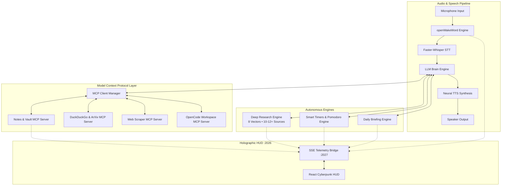

# A.T.H.E.N.A. (Adaptive Thinking Hands-free Engine for Neural Assistance)

> **A.T.H.E.N.A.** — *A local-first, voice-driven autonomous AI assistant with 24/7 always-on Android voice bridge, Model Context Protocol (MCP) tool orchestration, autonomous multi-source deep research engine, personal Markdown notes vault, and a real-time holographic cyberpunk web telemetry HUD.*

---

## 🌟 Key Capabilities

### 🎙️ 1. Real-Time Neural Voice Pipeline
- **Stage 1: Always-On Voice Capture & Wake Word (`audio_input.py`)**
  - Zero-latency timestamped ring buffer with pre-roll audio slicing.
  - Local CPU neural inference via `openWakeWord` with custom acoustic models (`"A.T.H.E.N.A."`).
  - Adaptive ambient noise floor tracking, anti-spike trigger gating, and push-to-talk (PTT) support.
- **Stage 2: Fast Local Neural STT (`stt.py`)**
  - High-speed neural speech transcription powered by `faster-whisper` (CTranslate2 `int8` / `float16`).
  - Silero VAD noise filtering, confidence scoring, and anti-hallucination suppression.
- **Stage 3: LLM Brain & Tool Chaining (`llm.py`, `tools.py`)**
  - Streaming tool-calling reasoning loop supporting Google Gemini AI Studio API & local Ollama models.
  - Multi-round function calling, system state injection, and AST-evaluated math sandbox.
  - Operator confirmation gating (`ask` / `always` / `never`) for terminal and shell commands.
- **Stage 4: Natural Neural Speech Synthesis (`tts.py`)**
  - Zero-cost, high-fidelity neural streaming via Edge-TTS with in-memory PyAV decoding.
  - Local offline ONNX neural playback via Piper TTS, plus ElevenLabs cloud support.
  - Acoustic self-echo flushing and speaker reverb decay protection.

---

### 🔬 2. Autonomous Multi-Source Deep Research Engine (`deep_research.py`)
- **8-Vector Academic & Technical Search Strategy:**
  - Decomposes research topics into 8 orthogonal exploratory vectors covering foundational theory, literature review (2024–2026), technical architecture & methodology, empirical benchmarks, real-world case studies, critical bottlenecks, academic repositories, and future research paradigms.
- **Multi-Engine Harvesting & Concurrent Scraping:**
  - Ingests and cross-references data across DuckDuckGo Web Search, ArXiv Scholarly Research API, and Wikipedia Technical Encyclopedia.
  - Multi-threaded parallel web scraping via `ThreadPoolExecutor` crawling up to 20 candidate sources simultaneously with hard timeouts.
  - Enforces a strict minimum threshold of **10 to 12 verified high-quality sources**.
- **College-Project / Publication-Grade Research Paper Synthesis:**
  - Formats output as an analyst-grade academic research paper:
    - 📑 **Formal Abstract** (250–350 words)
    - 📌 **Introduction & Problem Formulation**
    - 📚 **Theoretical Foundations & Literature Survey** (inline citations `[1]`, `[2]`, ...)
    - ⚙️ **Technical Architecture, System Models & Methodology**
    - 📊 **Empirical Evaluation, Benchmarks & Markdown Comparative Tables**
    - 🌍 **Real-World Applications & Industrial Case Studies**
    - ⚠️ **Critical Challenges, Bottlenecks & Limitations**
    - 🔮 **Future Outlook & Open Research Questions**
    - 🎯 **Conclusion & Project Summary**
    - 🔗 **References & Annotated Bibliography** (Complete numbered bibliography of all 10–12+ sources with active links and contribution annotations).
- **Isolated Model Fallback Cascade:**
  - Dedicated fallback sequence for research synthesis:
    $$\text{Gemini 3.7 Flash Lite / 2.5 Flash} \longrightarrow \text{Gemini Flash tiers} \longrightarrow \text{Gemini Pro} \longrightarrow \text{Local Ollama Gemma 26B} \longrightarrow \text{Local Academic Synthesizer}$$
  - Seamlessly handles rate limits (HTTP 429) without affecting the main chat/voice conversation model (`gemma-4-31b-it`).
- **Autonomous Note Vault Storage & Voice Alert:**
  - Automatically saves markdown reports directly into the Markdown Vault (`backend/data/notes/deep-research/`).
  - Spoken audio notification with intelligent interruption when research is completed.

---

### 🗄️ 3. Markdown Notes Vault & To-Do Checklist (`notes_mcp_server.py`)
- Folder-based Markdown (`.md`) vault organized by category: `general`, `deep-research`, `work`, `ideas`, `todos`.
- Structured YAML frontmatter parsing, automatic indexing (`notes_index.json`), and full-text search.
- Interactive To-Do checklist management with status tracking and priority flags.
- Full JSON-RPC 2.0 stdio Model Context Protocol (MCP) server integration.

---

### ⏱️ 4. Smart Timers, Pomodoro & Spoken Reminders (`timer_engine.py`)
- Background countdown timers and Pomodoro focus/break sessions (25m focus, 5m break, custom intervals).
- Natural language duration parsing (`"25 min"`, `"pomodoro"`, `"1 hour 15m"`).
- Spoken voice notifications and procedural audio chime triggers upon completion.
- Real-time synchronization with the frontend HUD via SSE.

---

### ☀️ 5. Daily Executive Briefing Engine (`briefing_engine.py`)
- Generates structured Morning Briefings and Evening Debriefs.
- Ingests live weather telemetry, active pending tasks, news headlines, and hardware telemetry.
- Synthesizes concise spoken voice executive summaries and detailed Markdown briefing logs.

---

### 🔌 6. Model Context Protocol (MCP) Ecosystem (`mcp_client.py`)
- Full compliance with the Anthropic Model Context Protocol (MCP 2024-11-05 spec) over stdio JSON-RPC 2.0.
- **Bundled MCP Servers:**
  - `notes-memory` (`notes_mcp_server.py`): Personal Markdown vault, notes, and task checklists.
  - `duckduckgo-search` (`duckduckgo_mcp_server.py`): Zero-key web search, ArXiv papers, and Wikipedia.
  - `web-scraper` (`web_scraper_mcp_server.py`): Clean article text extraction and hyperlink crawler.
  - `opencode-tools` (`opencode_mcp_server.py`): Sandboxed workspace code editing, AST analysis, and Git tracking.
- Visual MCP Server Manager & Tool Catalog Panel in the frontend.

---

### 🛸 7. Cyberpunk Holographic HUD (Frontend)
- Real-time Server-Sent Events (SSE) telemetry bridge (`:2027` -> `:2026`).
- 60 FPS HTML5 Canvas audio oscilloscope & multi-ring arc reactor core.
- Interactive **Notes Vault Reader & Editor** with live Markdown table rendering, task toggles, and citation pill formatting (`[1]`, `[2]`).
- Live Active Timers Bar, Daily Briefing Modal, Sensor Telemetry Gauges, and Audio Waveform Visualizer.
- Web Audio Procedural Sound Effects and Hold-to-Talk voice recognition.

---

## 🏗️ System Architecture



---

## 🚀 Quick Start

### 1. Prerequisites
- **Python 3.10+** (tested on Python 3.10 – 3.14)
- **Node.js 18+** and npm
- PortAudio / PulseAudio (or WSLg audio on WSL2)

### 2. Backend Setup
```bash
cd backend
python3 -m venv .venv
source .venv/bin/activate
pip install -r requirements.txt

# Configure environment keys
cp .env.example .env
# Edit .env to add your GOOGLE_API_KEY (free tier from Google AI Studio)
```

### 3. Frontend Setup
```bash
cd frontend
npm install
```

### 4. Launching A.T.H.E.N.A.
- **Start the Voice & Engine Backend:**
  ```bash
  cd backend
  ./run.sh          # Linux / WSL2
  # or: python3 main.py
  ```
- **Start the Holographic Web HUD:**
  ```bash
  cd frontend
  npm run dev
  ```
- Open `http://localhost:2026` in your browser.

---

## ⚙️ Configuration (`backend/.env`)

| Variable | Default | Description |
| :--- | :--- | :--- |
| `GOOGLE_API_KEY` | `""` | Google AI Studio API key for Gemini / Gemma models |
| `EV_LLM_PROVIDER` | `gemini` | Primary chat LLM provider (`gemini` or `ollama`) |
| `EV_LLM_MODEL` | `gemma-4-31b-it` | Primary conversational LLM model |
| `EV_OLLAMA_BASE_URL` | `http://localhost:11434` | Local Ollama endpoint URL |
| `EV_OLLAMA_MODEL` | `gemma4:e4b` | Local fallback model tag |
| `EV_TTS_PROVIDER` | `edge` | Neural TTS provider (`edge`, `piper`, `gtts`, `elevenlabs`) |
| `EV_TRIGGER` | `wakeword` | Activation mode (`wakeword` or `ptt`) |
| `EV_WAKE_WORDS` | `athena` | Target wake phrase |
| `EV_WAKE_WORD_THRESHOLD` | `0.35` | Wake word sensitivity threshold |
| `EV_CONFIRM_SHELL` | `ask` | Shell execution safety policy (`ask` / `always` / `never`) |
| `EV_BRIDGE_PORT` | `2027` | SSE event bridge port |

---

## 🛡️ Security & Sandboxing
- **Workspace Jailing:** MCP workspace tools strictly restrict filesystem read/write operations to the repository root.
- **Operator Gating:** Dangerous terminal commands require operator confirmation before execution.
- **AST Mathematical Engine:** Evaluates calculations using strict AST node validation without arbitrary code evaluation.
- **Origin-Gated Bridge:** Telemetry server restricts WebSocket and SSE connections to local origins.
